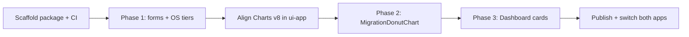

# Shared Components Package Plan

Plan to extract common UI (especially assessment-report charts and dashboard cards) into a publishable workspace package, consumed by:

- **`migration-planner-ui`** (`apps/agent-ui`) via Yarn workspaces — same pattern as `@openshift-migration-advisor/ioc`
- **`migration-planner-ui-app`** via npm — same pattern as `@openshift-migration-advisor/planner-sdk` / published `ioc`

> Implementation is deferred; this document is the blueprint.

---

## Goals

1. Single source of truth for report charts and shared PatternFly wrappers.
2. Publish under `@openshift-migration-advisor/*` so both repos can consume the same versions.
3. Mirror the existing `packages/ioc` layout, build, and release wiring.
4. Keep packages SDK-agnostic: cards/charts take plain props, not `agent-sdk` or `planner-sdk` types directly.

---

## Proposed package

| | |
|---|---|
| **Name** | `@openshift-migration-advisor/shared-components` |
| **Location** | `packages/shared-components/` |
| **Template** | `packages/ioc` (not `api-client` — that tree is a stale leftover) |

Optional later split (only if the package grows too large):

| Package | Contents |
|---|---|
| `@openshift-migration-advisor/ui-charts` | `MigrationDonutChart`, `IssuesBreakdownChart`, chart colors |
| `@openshift-migration-advisor/ui-report` | Dashboard cards, OS tier helpers |
| `@openshift-migration-advisor/ui-forms` | Form field wrappers, filters |

**Recommendation:** start with **one** package (`shared-components`) and subpath exports if needed (`@openshift-migration-advisor/shared-components/charts`, `/report`, `/forms`). Split only when publish size or release cadence requires it.

---

## Current state (baseline)

### How `ioc` works today (pattern to copy)

| Concern | Behavior |
|---|---|
| Workspace | Root `workspaces: ["apps/*", "packages/*"]` |
| Local consume | `apps/agent-ui`: `"@openshift-migration-advisor/ioc": "workspace:*"` + tsconfig project reference |
| Exports | `development` → `src/`, `import`/`types` → `dist/` |
| Build | `yarn run -T tsc -b` (composite, `nodenext`, `jsx: react-jsx`) |
| Publish | `.github/workflows/release.yaml` → OIDC npm Trusted Publishing on `packages/ioc/**` |
| Version | Repo version `0.0.0`; CI sets real version (`tag` or `{tag}-{sha}`) |

### Consumer differences

| | agent-ui | ui-app |
|---|---|---|
| Bundler | Vite 8 | Webpack (FEC) + Vite standalone |
| PatternFly Charts | **v8** (`@patternfly/react-charts/victory`) | **v7** |
| Report data SDK | `agent-sdk` | `planner-sdk` |
| IoC | workspace `ioc` | `@y0n1/react-ioc` (not our package) |
| Export | CSV | PDF / HTML |

These differences drive the phased extraction below.

---

## Package layout (to implement)

```
packages/shared-components/
├── package.json
├── tsconfig.json
├── README.md
├── LICENSE
├── .gitignore
└── src/
    ├── index.ts                 # public API re-exports
    ├── charts/
    │   ├── MigrationDonutChart.tsx
    │   ├── IssuesBreakdownChart.tsx
    │   └── constants.ts         # colors, empty-state titles
    ├── report/
    │   ├── Dashboard.tsx
    │   ├── OSDistribution.tsx
    │   ├── NetworkOverview.tsx
    │   ├── HostsOverview.tsx
    │   ├── ClustersOverview.tsx
    │   ├── StorageOverview.tsx
    │   ├── CpuAndMemoryOverview.tsx
    │   ├── VMMigrationStatus.tsx
    │   ├── CardEmptyState.tsx
    │   ├── osSupportTier/
    │   │   ├── osSupportTier.ts
    │   │   ├── SupportTierBadge.tsx
    │   │   ├── OsSupportTiersHelpPopover.tsx
    │   │   ├── OsUpgradeRecommendationPopover.tsx
    │   │   ├── OsUpgradeNotice.tsx
    │   │   └── useOsBarChartViewModel.ts
    │   └── tables/              # ErrorTable, WarningsTable (if shared)
    ├── forms/
    │   ├── CheckboxFormGroup.tsx
    │   ├── RadioFormGroup.tsx
    │   ├── TextInputFormGroup.tsx
    │   ├── TextAreaFormGroup.tsx
    │   ├── SelectFormGroup.tsx
    │   └── FormFieldHelperText.tsx
    └── filters/                 # AttributeValueFilter (optional phase)
```

### `package.json` essentials (mirror `ioc`, improve peers)

```json
{
  "name": "@openshift-migration-advisor/shared-components",
  "version": "0.0.0",
  "type": "module",
  "exports": {
    ".": {
      "development": "./src/index.ts",
      "import": "./dist/index.js",
      "types": "./dist/index.d.ts",
      "default": "./dist/index.js"
    },
    "./charts": {
      "development": "./src/charts/index.ts",
      "import": "./dist/charts/index.js",
      "types": "./dist/charts/index.d.ts",
      "default": "./dist/charts/index.js"
    }
  },
  "files": ["dist", "src", "LICENSE", "README.md"],
  "publishConfig": { "access": "public" },
  "peerDependencies": {
    "react": "^18.3.0",
    "react-dom": "^18.3.0",
    "@patternfly/react-core": "^6.5.0",
    "@patternfly/react-charts": "^8.0.0",
    "@patternfly/react-icons": "^6.5.0",
    "@patternfly/react-table": "^6.5.0",
    "@emotion/css": "^11.13.0"
  },
  "peerDependenciesMeta": {
    "@patternfly/react-charts": { "optional": true }
  },
  "scripts": {
    "build": "yarn run -T tsc -b",
    "bundle": "yarn build && yarn pack --out ../../out/%s-%v.tgz",
    "clean": "rm -rf node_modules dist .tmp",
    "check": "yarn run -T biome check .",
    "check:fix": "yarn run -T biome check --write .",
    "typecheck": "yarn run -T tsc -b --noEmit",
    "test": "yarn run -T vitest run"
  }
}
```

> **Charts major alignment:** `@patternfly/react-charts` **v8** is an **optional** peer, required only when importing `@openshift-migration-advisor/shared-components/charts`. The main entry (`forms` + `report`) must not re-export charts so ui-app on Charts 7 can consume OS cards without resolving `@patternfly/react-charts/victory`.

---

## Candidate components (by extraction priority)

### Phase 1 — Low risk, near-identical (ship first)

| Component | agent-ui | ui-app | ~Similarity |
|---|---|---|---|
| Form groups (`Checkbox`, `Radio`, `TextInput`, `TextArea`, `Select`, `FormFieldHelperText`) | `…/common/components/form/*` | `…/ui/core/components/form/*` | 96–100% |
| `useOsBarChartViewModel` | `…/Dashboard/useOsBarChartViewModel.ts` | `…/report/view-models/useOsBarChartViewModel.ts` | ~99% |
| `OsSupportTiersHelpPopover` | Dashboard | assessment-report | ~96% |
| `SupportTierBadge` | Dashboard | assessment-report | ~94% |
| `OsUpgradeRecommendationPopover` | Dashboard | assessment-report | ~92% |
| `osSupportTier` helpers | Dashboard | assessment-report | ~90% (SDK enum import differs → use shared string unions / mapped types) |
| `CardEmptyState` | Dashboard | `…/core/components/` | ~74% |
| Chart `constants` (colors / empty titles) | Dashboard | assessment-report | ~70% |

### Phase 2 — Chart primitive (unblocks most cards)

| Component | Notes |
|---|---|
| **`MigrationDonutChart`** | Same product concept; implementations diverge (~35% text match). Unify on agent-ui’s PF Charts **v8** / victory entrypoint, keep click handlers + legend from agent, themed tooltips from ui-app. |
| **`IssuesBreakdownChart`** | ui-app only today (CSS bars). Add to package once agent wants parity with export/issues view. |

### Phase 3 — Dashboard cards (after chart + OS helpers)

| Component | Similarity | Divergence to resolve |
|---|---|---|
| `Dashboard` shell | ~80% | agent adds VM drill-down props — make optional callbacks |
| `OSDistribution` | ~82% | icon naming (`DesktopIcon` vs `RhUiDesktopIcon`) — accept icon as prop or use shared PF icons |
| `NetworkOverview` | ~84% | minor |
| `HostsOverview` | ~70% | minor |
| `OsUpgradeNotice` | ~77% | minor |
| `ClustersOverview` | ~48% | ui-app has more views — share core, keep app-specific extras local |
| `StorageOverview` | ~33% | ui-app uses `ChartBar` + export modes |
| `CpuAndMemoryOverview` | ~31% | ui-app more views / export |
| `VMMigrationStatus` | ~27% | agent: issues donut + VM filter drill-down; ui-app: `IssuesBreakdownChart` + export |

**API design rule for cards:** accept already-shaped view data (`{ label, value, color }[]`, tier maps, etc.) plus optional callbacks (`onSliceClick`, `isExportMode`). Do **not** import `@openshift-migration-advisor/agent-sdk` or `planner-sdk` inside the package.

### Phase 4 — Optional / later

| Item | Why later |
|---|---|
| `AttributeValueFilter` | Shared origin (~62%); agent is more featureful — align APIs carefully |
| `ErrorTable` / `WarningsTable` | Same idea, different richness |
| PDF/HTML export (`OffScreenRenderer`, export services) | ui-app only; heavy deps (`jspdf`, `html2canvas`) |
| Agent-only: Report Comparison, VM tab, Applications, CSV export, Storage Offload Estimator | Product-specific |
| Dead candidates in ui-app (`ReportBarChart`, `ReportPieChart`, `MigrationChart`) | Appear unused — do not extract |

---

## Main changes required

### A. In `migration-planner-ui` (this repo)

1. **Create** `packages/shared-components` (structure above).
2. **Wire workspace**
   - Already covered by `"packages/*"` — no root `package.json` workspace change needed.
   - Add `"@openshift-migration-advisor/shared-components": "workspace:*"` to `apps/agent-ui/package.json`.
   - Add tsconfig project reference in `apps/agent-ui/tsconfig.app.json` (same as `ioc`).
3. **Biome** — add React-domain override for the new package (mirror `packages/ioc`).
4. **Move / re-export** Phase 1–3 components from agent-ui into the package; update agent-ui imports.
5. **CI publish** — done: `.github/workflows/release-shared-components.yaml` mirrors the `ioc` publish workflow (OIDC Trusted Publishing via `kubev2v/migration-planner-workflows` `build-and-publish-package.yml`).
6. **PR CI** — existing `yarn workspaces foreach` build/typecheck/test should pick it up automatically; verify `detect-changed-workspaces` if path filters matter.
7. **README** — document install, peers, and example usage (like `packages/ioc/README.md`).

### B. In `migration-planner-ui-app` (sibling repo)

1. **Upgrade** `@patternfly/react-charts` **7 → 8** (and victory import path) before consuming chart/card components.
2. **Add dependency** `"@openshift-migration-advisor/shared-components": "<published-version>"` (npm). ui-app `.npmrc` already excludes `@openshift-migration-advisor/*` from min-release-age.
3. **Replace** local duplicates under `src/ui/core/components/` and `assessment-report/` with package imports.
4. **Keep** app-specific wiring: `ReportStore`, planner-sdk types, PDF export, chrome/FEC, `ReportFilterBar`, cluster sizer — map SDK models → shared props at the boundary.
5. **Do not** switch IoC to workspace `ioc` as part of this work (out of scope unless desired later).

### C. Cross-cutting design rules

| Rule | Detail |
|---|---|
| SDK-agnostic | Shared types live in the package (or a tiny `shared-types` later). Apps map SDK → props. |
| Peer deps | React, PatternFly, emotion — never bundle them. |
| NodeNext imports | Relative imports use `.js` extensions (match `ioc`). |
| Styles | Prefer `@emotion/css` colocated styles (both apps already use it). Avoid SASS in the package. |
| Export mode | Keep `isExportMode` / `exportAllViews` as optional props so ui-app PDF path keeps working. |
| Drill-down | Optional callbacks only — agent-ui VM filtering stays in the app. |
| Icons | Prefer `@patternfly/react-icons`; avoid app-specific `RhUi*` unless passed in as props. |

---

## Consumption examples (target)

### agent-ui (workspace)

```ts
import {
  OSDistribution,
  SupportTierBadge,
} from "@openshift-migration-advisor/shared-components";
import { MigrationDonutChart } from "@openshift-migration-advisor/shared-components/charts";
```

### ui-app (npm)

```bash
npm install @openshift-migration-advisor/shared-components
```

```ts
import {
  OSDistribution,
  SupportTierBadge,
} from "@openshift-migration-advisor/shared-components";
```

`MigrationDonutChart` is on `@openshift-migration-advisor/shared-components/charts` and needs PatternFly Charts **v8** (`@patternfly/react-charts/victory`). ui-app stays on Charts v7 until that donut is unified; do not import `/charts` from ui-app until then.

---

## Suggested implementation order



1. **Scaffold** empty package + build + publish workflow (can publish a stub).
2. **Extract Phase 1** into package; switch agent-ui; publish; switch ui-app forms/OS helpers.
3. **Align PatternFly Charts** in ui-app to v8.
4. **Unify `MigrationDonutChart`**; switch both apps.
5. **Extract dashboard cards** one-by-one (start with `NetworkOverview` / `OSDistribution`, finish with `VMMigrationStatus` / `StorageOverview`).
6. **Cleanup** duplicated local files; add package tests for chart + form primitives.

---

## Risks and open decisions

| Risk / decision | Recommendation |
|---|---|
| PatternFly Charts 7 vs 8 | Upgrade ui-app to v8; do not dual-support majors in one package |
| agent-sdk vs planner-sdk types in cards | Define shared prop interfaces; adapters in each app |
| One package vs many | One package first |
| Publish cadence | Same as `ioc` (push to `main`/`stable` under package path, or `v*` tags) |
| Should ui-app also use `@openshift-migration-advisor/ioc`? | Separate initiative; not required for shared components |
| PDF export in shared package? | No — keep in ui-app; only pass `isExportMode` into shared cards |
| Package name | Confirm `shared-components` vs `ui` / `report-ui` with the team |

---

## Source path reference

### agent-ui (this repo)

- Dashboard: `apps/agent-ui/src/pages/VirtualMachinesOverview/components/Dashboard/`
- Forms: `apps/agent-ui/src/common/components/form/`

### ui-app

- Assessment report: `migration-planner-ui-app/src/ui/report/views/assessment-report/`
- Core charts/forms: `migration-planner-ui-app/src/ui/core/components/`

### Existing package template

- `packages/ioc/` — structure, exports, scripts, CI

---

## Publishing (`@openshift-migration-advisor/shared-components`)

Same mechanism as `@openshift-migration-advisor/ioc`:

| File | Role |
|---|---|
| `.github/workflows/release-shared-components.yaml` | Triggers on `packages/shared-components/**` (main/stable) or `v*` tags |
| `kubev2v/migration-planner-workflows` → `build-and-publish-package.yml` | Install → build → set version → `npm publish` via OIDC |

**Before the first publish**, configure an npm **Trusted Publisher** for `@openshift-migration-advisor/shared-components` pointing at workflow file `release-shared-components.yaml` (same org setup as `ioc`).

---

## Out of scope (for now)


- Migrating ui-app IoC to `@openshift-migration-advisor/ioc`
- Sharing PDF/HTML export stack
- Sharing agent-only report comparison / VM table / CSV export
- Reviving or replacing `packages/api-client`
- Federated module federation of the UI package (npm package is enough)

---

## Next step

When ready to implement: start with **scaffold + Phase 1** (forms + OS tier helpers), wire `workspace:*` in agent-ui, extend `release.yaml`, then publish a first version for ui-app consumption.
